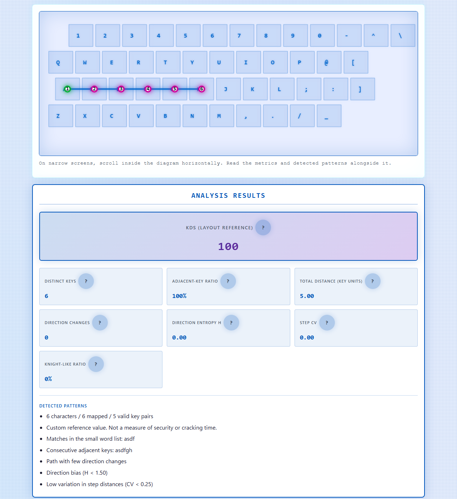
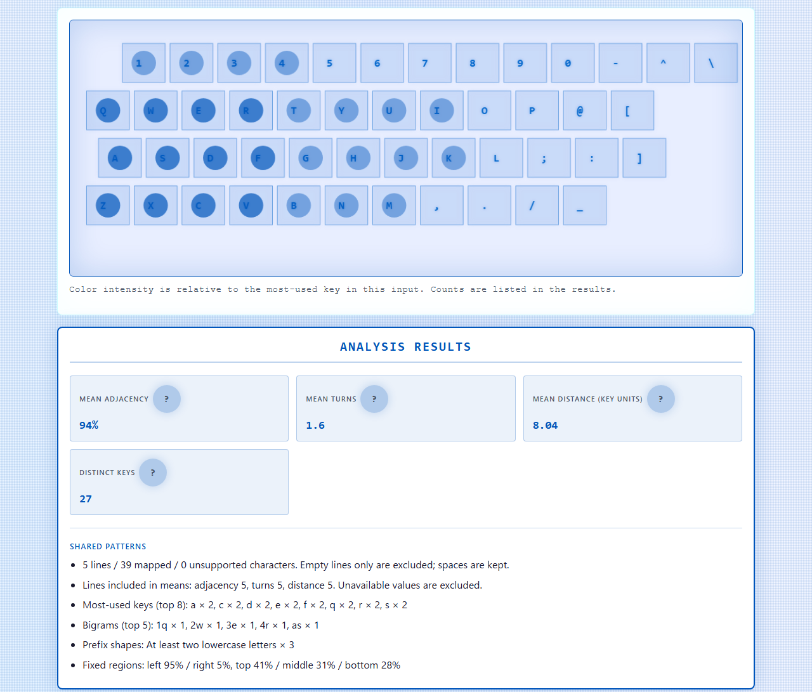
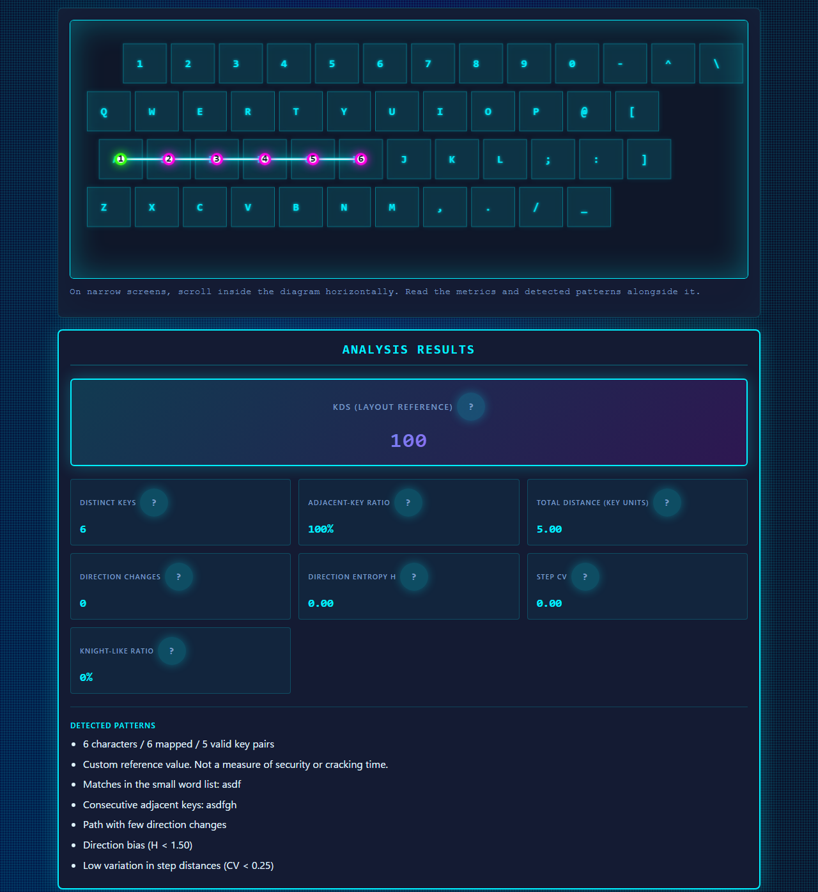

English · [日本語](README.md)

# KeyWalk Analyzer — Keyboard-Dependent Password Analysis Tool


[](https://ipusiron.github.io/keywalk-analyzer/)

**Day089 - 100 Security Tools with Generative AI**

KeyWalk Analyzer is an educational tool that places learning strings on keyboard coordinates to explore keyboard walks (sequences of adjacent keys) and repetition. It can also summarize key frequencies and shared string features across multiple lines.

**It does not assess password strength, safety, or cracking time.** KDS is a custom geometric reference value. The results cannot identify a person or establish their usual typing behavior.

---

## 🌐 Demo

[Open KeyWalk Analyzer](https://ipusiron.github.io/keywalk-analyzer/) (no installation required)

### Quick start

1. In Single analysis, select a sample or enter a string made for learning.
2. Select a layout, then click Analyze to inspect the path and metrics.
3. In Pattern profile, enter one string per line and click Analyze patterns.
4. Open a “?” explanation by clicking, tapping, or focusing it with the keyboard. Press Escape to close it.

Do not enter real passwords or secrets. The app neither sends nor saves input, but it cannot control browser or extension behavior or prevent someone from viewing your screen.

---

## 📸 Screenshots



Single analysis: an example with 100% adjacency and a path length of 5.00 key units.



Pattern profile: frequency counts for learning samples.



The dark theme displays the same values.

---

## 👥 Intended users

- Security learners and educators: explore character variety separately from regularity in key positions
- Researchers and engineers: inspect geometric features of data they prepare
- Puzzle designers and computing teachers: explore layout-dependent interpretations, frequencies, and entropy

The author does not encourage misuse. Do not use this output alone to judge a person's characteristics or password safety.

---

## ⌨️ What is keyboard walking?

Keyboard walking is a sequence of characters that follows key positions. `qwerty` and `asdfgh` are horizontal examples. This tool maps strings onto the selected layout. It does not record the keys actually pressed or the movement of fingers.

### Research context and scope of evaluation

String regularity and resistance to attacks are different questions. This tool's KDS and thresholds have not been calibrated against attack data. They do not reproduce research success rates or frequencies in leaked data.

Real authentication design also requires measures such as checking against blocklists of common or compromised values. See [NIST SP 800-63B-4](https://pages.nist.gov/800-63-4/sp800-63b.html#passwordver). This tool does not perform that check.

---

## 🖥️ Input devices and keyboard layouts

### Supported simplified layouts

The tool models the alphanumeric and punctuation sections of QWERTY (US), JIS (Japanese/simplified), and Dvorak. Key spacing is 1 in the coordinate model; it does not measure physical dimensions or typing comfort.

Uppercase ASCII letters map to the same keys as lowercase letters, and shifted symbols map to the corresponding keys in the selected layout. For example, JIS maps `&` to `6` and `+` to `;`. US maps `&` to `7` and `+` to `=`.

JIS maps `\` to the number row and `_` to a bottom-row key. Text alone cannot recover which of several physical keys produced the same character, or resolve differences involving the yen sign. The U+00A5 yen sign is unsupported. There is no fallback mapping to QWERTY.

### Input methods outside the model

Kana layouts, IME composition, AZERTY, QWERTZ, numeric keypads, ATM PIN pads, and smartphone pattern locks are not modeled. The interface works on narrow mobile screens, but it does not measure flick input or finger movement on software keyboards.

`KeyboardEvent.code`, which identifies a physical key, differs from an input character. See the [W3C UI Events layout overview](https://www.w3.org/TR/uievents-code/#keyboard-layout). This tool analyzes text in the input field, not a keystroke history.

---

## 🔧 Features

### 1. Single analysis

The tool provides path (lines) and dots-only displays, three layouts, and learning samples. Green marks each segment's start and pink the remaining points; these are not safety colors. Numbers are one-based positions in the original string.

| Metric | Definition and limitation |
|---|---|
| Unique keys | Number of distinct mapped keys; uppercase letters and Shift do not count as separate keys |
| Path length | Sum of Euclidean distances between consecutive mapped keys, in units of key spacing 1, not px or cm |
| Turns | Number of angles greater than 0.6 radians between consecutive nonzero moves; “—” if no pair can be compared |
| Adjacency | Share of consecutive mapped key pairs that use different keys with horizontal and vertical differences both at most 1 |
| Direction entropy H | A value from 0 to 3 bits calculated from eight direction bins for nonzero moves; not password entropy |
| Step CV | Population standard deviation of step distances divided by their mean; “—” for fewer than 2 steps or mean 0 |
| Knight ratio | Share of moves close to a 2:1 or 1:2 horizontal-to-vertical displacement, with horizontal tolerance 0.25; not randomness |
| KDS | A custom reference value from 0 to 100 combining geometric features; neither high nor low values establish safety |

Same-key repetitions are included in the denominators for adjacency, knight ratio, and CV, but do not count as adjacent moves, directions, or turns. Spaces and unsupported characters break paths; distances, moves, and walks never bridge those gaps.

KDS is shown only when there are no unsupported characters, at least 4 mapped characters, and at least 3 nonzero moves. Weights are 30% adjacency, 25% direction bias, 20% straightness, 15% listed words/walks/repetition, and 10% distance uniformity. See [ARCHITECTURE.md](ARCHITECTURE.md) for the formula.

Detection covers adjacent walks of at least 3 characters, 7 listed words, and repeated substrings of 2–4 characters (at least 3 occurrences, including overlaps). The words are `qwerty`, `asdf`, `zxcv`, `1234`, `password`, `pass`, and `admin`. No match is not evidence of safety.

### 2. Pattern profile

Multiple lines are summarized as a key-frequency heatmap, the top 8 keys, the top 5 bigrams, prefix/suffix formats, and fixed-region percentages. Heatmap intensity is relative to the most frequent key in the supplied set.

- Means: adjacency, turns, and path length are arithmetic means of per-line values. Undefined rows are excluded, and each metric's contributing line count is shown
- Mean path length: lines with no mapped key pair are excluded; zero distances from same-key repetition are included
- Regions: left/right split at the whole layout's midpoint; top includes the number row and the following row, middle is the home row, and bottom is the last row. These are not hand-usage rates
- Year-like suffixes: match 1900–2099 and trailing `!?.` characters, without establishing an actual year or birthday
- Counting: only empty lines are excluded. Leading/trailing spaces are retained, and duplicate lines count repeatedly
- Bigrams: letter case is merged, but shifted symbol characters remain distinct. Bigrams never cross unsupported characters or line boundaries

These counts cannot establish whether strings came from the same person or how they usually type.

---

## 📖 Usage

### Single analysis tab

Enter a string, select a layout, and analyze it. Editing the input or changing the layout clears that tab's results. Changing the display mode, language, or theme redraws the retained results.

### Pattern profile tab

Enter one learning string per line. Its input, layout, and results are independent of Single analysis. Clear removes the current tab's input and results, not the other tab or the clipboard.

You can select tabs with the left/right arrows, Home, and End. On narrow screens, scroll the keyboard diagram horizontally. Read the metrics and findings as well as the diagram.

### Language, theme, and local use

Initial language is selected from `?lang=ja|en`, the saved preference, then the browser language, in that order. Initial theme uses the saved preference, then the OS color scheme. The app also works when storage is unavailable.

Open `index.html` directly in a browser. With Python available, you can serve the repository root over HTTP without installing packages:

```sh
python -m http.server 8000 --bind 127.0.0.1
```

Open `http://127.0.0.1:8000/`.

---

## 💡 Sample inputs

### Single analysis

These values are checked against the calculation module. Distance and H use two decimal places, and adjacency is rounded to a whole percent. `—` means not calculated. An empty input clears the on-screen metrics.

| Input | Layout | Unique keys | Path length | Adjacency | H | KDS |
|---|---|---:|---:|---:|---:|---:|
| `a` | jis | 1 | 0.00 | — | — | — |
| `aaaa` | jis | 1 | 0.00 | 0% | — | — |
| `asdfgh` | jis | 6 | 5.00 | 100% | 0.00 | 100 |
| `hgfdsa` | jis | 6 | 5.00 | 100% | 0.00 | 100 |
| `qwerty123!` | jis | 9 | 13.37 | 78% | 0.76 | 57 |
| `asd fgh` | jis | 6 | 4.00 | 100% | 0.00 | — |
| `aoeuid` | jis | 6 | 23.67 | 20% | 0.97 | 17 |
| `aoeuid` | dvorak | 6 | 5.00 | 100% | 0.00 | 100 |

In `asd fgh`, the space separates `asd` and `fgh` into two walks. Even 100% adjacency does not mean the entire input was evaluated. A KDS of 17 for `aoeuid` does not mean “safe.”

### Pattern profile

These two lines give 4 unique keys, mean adjacency 100%, mean path length 2.00, and left-side usage 75%. Only the `asd` line contributes to the means. `p` counts toward key frequencies, but has no move and is excluded from mean path length and adjacency.

```text
asd
p
```

---

## 🎯 Use cases

Ways of using this tool in particular

- Distinguish direction diversity from direction itself in a computing class: on JIS, `asdfgh` and `hgfdsa` run in opposite directions but both have path length 5.00 and H=0.00. H alone cannot recover the direction; the original path is needed.
- Use a layout as a puzzle hint: adjacency for `aoeuid` is 20% on JIS and 100% on Dvorak. Naming a layout can give the same string another interpretation, but is not evidence of the actual input device or its user's layout.
- Explore duplicate observations in survey data: on JIS, two lines `asd / p` give left-side usage 75%, while three lines `asd / asd / p` give 86% (`/` here denotes a newline). This illustrates duplicate counting and sample bias, not a change in a person's habits.

Other uses

- Compare character variety and key positions in public samples during security training. Do not turn lowering KDS into an exercise or use it for pass/fail decisions
- Inspect paths in candidate strings for CTF or dictionary research. The tool does not generate/export dictionaries or crack passwords
- Explain why geometric metrics cannot establish exposure, reuse, or authentication rate limiting when discussing authentication design. Do not collect secrets from real accounts
- Discuss public samples at home to distinguish changing a string from managing a different long password for each service

---

## ⚙️ Limitations

- Single input: 10,000 characters. Multiple lines: 50,000 characters total, 500 nonempty lines, and 10,000 characters per line. Counts use Unicode code points
- Exceeding a limit clears results and reports an error, without truncation. Analysis is disabled during IME composition
- Paths show the first 500 mapped points; finding lists show the first 20 items per kind. Omission notices are shown, and metrics use all input within the limits
- Spaces, Japanese text, emoji, and other unsupported characters are reported with their positions. Invisible characters use `[U+XXXX]` notation
- Physical dimensions, hand use, timing, typing comfort, password strength, cracking time, and identity are not assessed
- The public Mixed samples are not randomly generated secure secrets. Do not use them as real passwords

---

## 💻 Technical specifications

### Front end

The app uses HTML, CSS, JavaScript, and Canvas. No build, external fonts, libraries, or additional dependencies are required. The calculation module is independent of the DOM; ordinary browser scripts and Node.js CommonJS use the same implementation.

### Security

The app neither transmits nor persists input. Only `theme` and `language` are saved in localStorage. CSP restricts connections and form submissions; it does not prevent the initial page load or external links opened by the user.

The app does not claim to set `X-Frame-Options` or `X-Content-Type-Options` through HTML meta elements. HTTP response headers are controlled by the host. [SECURITY.md](SECURITY.md) describes the design and limitations.

### Browser support

A browser supporting JavaScript, Canvas, and Unicode property escapes is expected. Automated verification for this change uses Chromium with HTTP and `file://`, Japanese/English, both themes, and widths of 320, 390, and 1280px. Firefox, Safari, and touch interaction on physical devices are unverified.

---

## 🧪 Tests

Run with Node.js 22 or later. No package installation is required.

```sh
npm test
```

Tests cover layouts, shifted symbols, unsupported characters, boundaries, aggregation, bilingual dictionaries, README tables, CSP, contrast, and source formatting. GitHub Actions runs the same tests on push and pull_request.

---

## 📁 Directory structure

```text
keywalk-analyzer/                      # Project root
├── .github/                           # GitHub configuration
│   └── workflows/                     # Automated testing
│       └── test.yml                   # Node.js 22 checks on push and PR
├── assets/                            # Screenshots and icon
│   ├── en/                            # English screenshots
│   │   ├── screenshot.png             # English single analysis, light
│   │   ├── screenshot2.png            # English profile, light
│   │   └── screenshot3.png            # English single analysis, dark
│   ├── favicon.svg                    # Site icon
│   ├── screenshot.png                 # Japanese single analysis, light
│   ├── screenshot2.png                # Japanese profile, light
│   └── screenshot3.png                # Japanese single analysis, dark
├── test/                              # Dependency-free regression tests
│   ├── core.test.js                   # Layouts, metrics, boundaries
│   ├── format.test.js                 # Formatting and non-minification
│   ├── messages.test.js               # JA/EN dictionary parity
│   ├── readme.test.js                 # Bilingual examples, images, structure
│   ├── security.test.js               # CSP, persistence, control structure
│   ├── settings.test.js               # Initial preferences and storage denial
│   └── ui.test.js                     # Layout and contrast
├── .gitignore                         # Git exclusions
├── .nojekyll                          # Disable Jekyll processing
├── ARCHITECTURE.md                    # Formulas and design
├── CLAUDE.md                          # Development instructions
├── LICENSE                            # MIT license
├── README.md                          # Japanese documentation
├── README.en.md                       # English documentation
├── SECURITY.md                        # Security measures and limits
├── index.html                         # Interface and meta CSP
├── keywalk-core.js                    # DOM-independent calculation
├── keywalk-messages.js                # JA/EN analysis messages
├── keywalk-ui-messages.js             # JA/EN static text and attributes
├── package.json                       # Node.js test configuration
├── script.js                          # Rendering and state management
├── settings.js                        # Initial language and theme
└── style.css                          # Themes and responsive layout
```

---

## ⚠️ Important security notes

Do not enter real passwords, reused strings, or secrets. Clear empties the current app tab; it does not guarantee removal from browser restoration, extensions, the clipboard, screenshots, or memory.

### ✅ Suggested examples

- Learn with the public on-screen samples
- Compare strings created for learning and not used for authentication
- Teach how data collection affects observations and their limitations

---

## 📚 Related resources

### Developer documentation

- [ARCHITECTURE.md](ARCHITECTURE.md): coordinate model, metrics, KDS formula, and state management (Japanese)
- [SECURITY.md](SECURITY.md): communication/storage scope and limitations (Japanese)
- [NIST SP 800-63B-4](https://pages.nist.gov/800-63-4/sp800-63b.html): authentication and password guidance, not a basis for KDS
- [W3C UI Events KeyboardEvent code Values](https://www.w3.org/TR/uievents-code/): physical keys versus input characters
- [W3C Content Security Policy](https://w3c.github.io/webappsec-csp/): CSP delivery and directives

### Book

- [『ハッキング・ラボで遊ぶために辞書ファイルを鍛える本』](https://akademeia.info/?page_id=22508) (Japanese-language book): section 5.4 on generating keyboard-walking password dictionaries, pp. 79–88

---

## 📄 License

MIT License — see [LICENSE](LICENSE) for details.

---

## 🛠 About this tool

This tool was developed as part of the “100 Security Tools with Generative AI” project. The project uses AI assistance to create and publish a variety of security-related tools over 100 days.

For project details and other tools, visit:

🔗 [100 Security Tools with Generative AI](https://akademeia.info/?page_id=42163)
