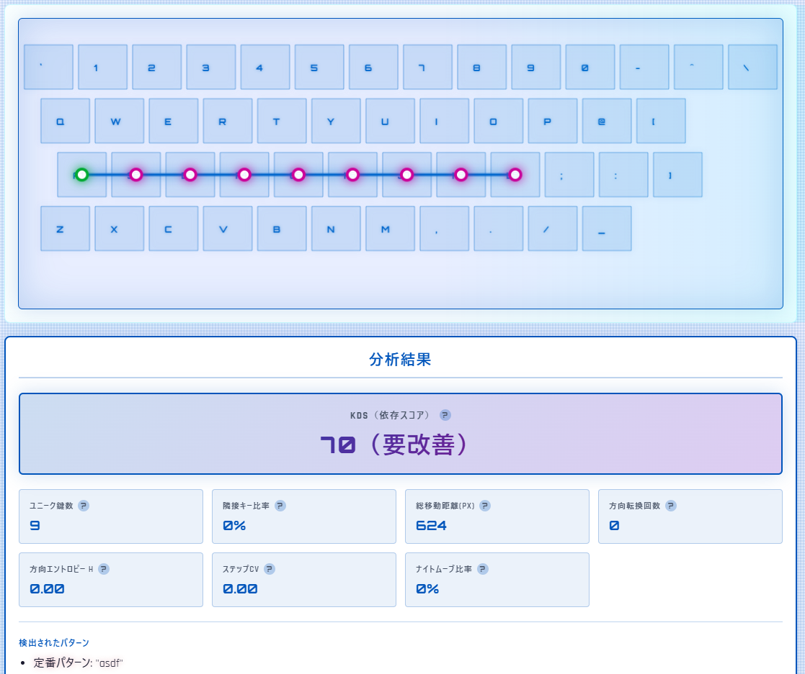
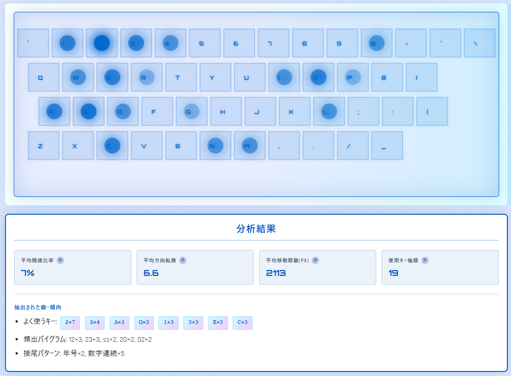

<!--
---
title: KeyWalk Analyzer
category: password-analysis
difficulty: 3
description: Visualize password paths on a keyboard, detect walking patterns, and profile user-specific typing habits.
tags: [password, keyboard, visualization, analyzer, javascript]
demo: https://ipusiron.github.io/keywalk-analyzer/
---
-->

# KeyWalk Analyzer — キーボード依存パスワード分析ツール


[](https://ipusiron.github.io/keywalk-analyzer/)

**Day089 - 生成AIで作るセキュリティツール100**

**KeyWalk Analyzer** は、パスワードを**キーボード座標上に可視化**し、「キーボード歩き（隣接キー連続入力）」や「直線的な移動」などのパターンを検出する教育用ツールです。

また、同じ利用者が入力した複数のパスワードから、**入力の癖や傾向（プロファイル）** も抽出できます。

---

## 🌐 デモページ

👉 **[https://ipusiron.github.io/keywalk-analyzer/](https://ipusiron.github.io/keywalk-analyzer/)**

ブラウザーで直接お試しいただけます（インストール不要）。

### クイックスタート

1. 上記のデモページにアクセス
2. **単体分析タブ**：
   - 「サンプル」ボタンで例を読み込むか、パスワードを入力
   - 「分析する」をクリック
   - KDSスコアと詳細指標、キーボード上の経路を確認
3. **癖プロファイルタブ**：
   - 「サンプル」ボタンで例を読み込むか、複数パスワードを入力（1行につき1つ）
   - 「癖を分析」をクリック
   - ヒートマップと抽出された癖・傾向を確認

**💡 ヒント：** 各項目の「?」アイコンにマウスを合わせると詳しい説明が表示されます。

**⚠️ 重要：** 入力データはすべてブラウザー内で処理され、ネットワークに送信されず、保存もされません 

---

## 📸 スクリーンショット

>
>*キーマップウォーキングパスワードを可視化*
>
>
>*パスワード決定時の癖を可視化*

---

## 👥 対象ユーザー

本ツールは、以下のような方々を対象としています：

- **セキュリティ研究者・教育者**: パスワードパターンの学術研究や教育教材として活用
- **セキュリティエンジニア**: 組織のパスワードポリシー策定・監査のためのデータ分析
- **ペネトレーションテスター**: レッドチーム演習やCTF競技での辞書ファイル作成
- **システム管理者**: 社内セキュリティトレーニングや意識向上プログラムの実施
- **セキュリティ学習者**: パスワードの脆弱性やキーボード依存パターンの理解を深めたい方
- **一般ユーザー**: 自分のパスワード選択の癖を客観的に把握し、セキュリティ意識を高めたい方

---

## ⌨️ キーマップウォーキングとは

**キーボードウォーキング（Keyboard Walking / Keyboard Pattern）** とは、キーボード上で隣接するキーを連続して入力することで作成されるパスワードパターンのことです。

この手法は、ユーザーが記憶しやすいパスワードを作成したいという動機から生まれたもので、一見するとランダムに見えますが、実際にはキーボードの物理的配置に強く依存しています。

代表的な例として、`qwerty`、`asdfgh`、`1qaz2wsx`、`zxcvbnm` などがあります。
スマートフォンのダイヤルパッドでの `Adgjmptw`（2〜9キーを順に押す）なども同様のパターンです。

---

### 学術的背景

Chou et al. (2012) による研究では、キーボードパターンを「隣接パターン（Adjacent Pattern）」と「並行パターン（Parallel Pattern）」に分類するAPパターンフレームワークが提唱されました。
この研究により、APパターンを用いることで、ブルートフォース攻撃と比較してパスワード空間が約2^44.47倍小さくなることが示されています 。

Yang et al. (2021) の包括的研究では、パターンベースのパスワードの50%以上が完全にキーボードパターンのみで構成されており、その頻度分布がZipfの法則に従うことが明らかになりました。
また、ユーザーは水平方向の連続キーや、キーボード左上部分の文字を好む傾向があることも判明しています 。

---

### 実証データ

Specops Software（2023）による8億のパスワードデータセット分析では、もっとも頻出するキーボードウォーキングパターンは「qwert」で、140万回以上検出されました。
続いて「qwerty」が100万回以上、「asdfg」なども高頻度で確認されています 。

DashlaneとVirginia Tech（2018）による6100万の漏洩パスワード分析でも、キーボード左側のキー（`1qaz`、`2wsx`など）を片手の指一本で入力できるパターンが多数発見されました 。

---

### キーマップウォーキングパスワードの特徴

#### 1. **利便性と記憶容易性**

- ユーザーは記憶しやすいパスワードを作成するために、キーボード上を「歩く」ように入力します 
- 物理的な位置関係を利用することで、文字列自体を覚えずとも「指の動き」として記憶できる

#### 2. **パターンの分類**

学術研究で定義されている主なパターン：

- **隣接パターン（Adjacent Pattern）**: 隣り合うキーを順に押す（例: `qwerty`, `asdfgh`）
- **並行パターン（Parallel Pattern）**: 同じ方向の複数行を並行して押す（例: `1qaz2wsx`）
- **ノコギリパターン（Sawtooth Pattern）**: ジグザグに移動する（例: `q2w3e4r`）
- **直線パターン**: 一方向に移動する（例: `123456`, `asdf`）

#### 3. **脆弱性の高さ**

- 攻撃者はこの人間の傾向を熟知しており、パスワードクラッキングツールには専用の辞書が組み込まれています 
- APパターンを使用した攻撃では、通常の辞書攻撃と比較して114%多くのパスワードをクラック可能という研究結果があります
- kwprocessorなどの専用キーボードウォーク生成ツールも公開されており、攻撃が容易化しています

#### 4. **複雑性要件の回避手段**

- 多くのシステムで求められるパスワード複雑性要件（大小文字・数字・記号の混在）を満たしつつ、記憶しやすいパスワードを作るための「抜け道」として利用される傾向があります
- 例: `Qwerty123!` は複雑性要件を満たしますが、本質的には脆弱なパターンです

#### 5. **レイアウト依存性**

- QWERTY、JIS（日本語）、AZERTY（フランス語）、Dvorakなど、キーボードレイアウトごとに異なるパターンが生成されます
- AZERTYレイアウトでは「xcvbn」が143,000回以上、QWERTZでは「qwert」が140万回以上検出されています 

#### 6. **検出と防御の重要性**

- 組織は、Specops Password Policyなどのサードパーティツールを使用して、一般的なキーボードパターンの使用を禁止することが推奨されます 
- パスワードマネージャーの利用により、人間が記憶する必要性を減らし、真にランダムで強固なパスワードを使用できます

このツールは、こうしたキーボード依存パターンを可視化・検出することで、ユーザー自身がパスワードの脆弱性を理解し、改善する手助けをすることを目的としています。

---

## 🖥️ 入力デバイスとキーボードレイアウトによる変化

キーボードウォーキングパスワードは、入力デバイスや端末、言語によって大きく変化します。これは、キーの物理的配置がデバイスごとに異なるためです。

---

### 1. 物理キーボードレイアウトの地域差

#### 主要なキーボード規格

Specops Software（2023）の研究では、QWERTY、AZERTY、QWERTZの3つの主要なラテン文字キーボードレイアウトについて分析が行われました 。

**検出されたパターンの違い：**

- QWERTY配列：「qwert」が140万回以上、「qwerty」が100万回以上検出 
- AZERTY配列（フランス語圏）：「xcvbn」が143,000回以上、「asdfg」「tress」が頻出 
- QWERTZ配列（ドイツ語圏）：「qwert」が140万回以上、「asdfg」「xcvbnm」が頻出 

JISキーボード（日本）は109キー構成でL字型のEnterキーを持ち、スペースバー周辺に日本語入力用の特殊キーが配置されています。ANSI（米国標準）は104キー、ISO（欧州標準）とは記号キーの配置が異なります 。

---

### 2. 言語とIME（Input Method Editor）の影響

#### 中国語圏のパスワード特性

Li et al.（2014）による1億以上の中国語パスワード分析では、中国語話者は数字を好み、英語話者は文字（特に小文字）を好むことが判明しました。
もっとも一般的な中国語パスワード構造は6桁の数字で、英語では6文字の小文字です 。

中国語ユーザーは英語ユーザーよりもキーボードパターンを使用する傾向が高く、これはラテン文字が記憶しにくいためと考えられています 。

**注目すべき事例：「ji32k7au4a83」**
Have I Been Pwnedで141回検出されたこのパスワードは、中国語の「我的密碼」（wo de mi ma = 私のパスワード）を注音符号（Zhuyin）キーボード配列で入力し、英語（ANSI）配列として解釈したものです 。これは、キーボードレイアウトの切り替えミスが予期しないパスワードパターンを生成する典型例です。

#### ロシア語圏の変換パターン

2024年の研究では、ロシア語話者がQWERTY配列に設定したまま、ロシア語キーボードレイアウト（JCUKEN）に従ってタイプすることで、一見ランダムな文字列が生成されることが示されました。
100万のロシア語パスワードを分析した結果、約1%が完全にこの変換パターンを示し、さらに6%が部分的に一致しました 。

#### 日本語圏の入力方式

日本では、ローマ字入力とかな入力の2つの主要な方式があります。
JISキーボードにはひらがなとローマ字の両方が印字されており、モード切替キーで切り替えます。
パスワード入力時は通常IMEをオフにしてASCII文字で入力するため、日本語特有のキーボードウォーキングパターンは発生しにくい傾向があります。

---

### 3. スマートフォンのパターンロック

Lancaster大学、中国西北大学、Bath大学（2017）の共同研究では、Androidのパターンロックが5回以内の試行で95%以上の確率で破られることが実証されました 。

**脆弱性の詳細：**

- 複雑なパターンほど1回目の試行で破られやすく（複雑パターンの95%、中程度の複雑さで87.5%、単純パターンで60%） 
- 米国海軍兵学校とメリーランド大学（2017）の研究では、パターンロックは1回の観察で64.2%（複数回観察で79.9%）、線なしパターンでも35.3%（複数回で52.1%）の成功率でショルダーサーフィン攻撃に対して脆弱でした 

一方、6桁のPINは1回の観察で10.8%、複数回観察でも26.5%の攻撃成功率に留まり、パターンロックよりも安全であることが示されました 。

Androidのパターンロックは3×3または3×4グリッドを使用し、これは数字キーパッドと同じ配置です。
たとえば、左上から時計回りにすべての角を通るパターンは、3×3で「1397」、3×4で「13#*」というPINと等価です 。

---

### 4. 物理テンキー（ATM、スマートロック等）

#### ATMのPINパッド

セキュリティ専門家の分析では、ATMユーザーが選ぶPINには明確なパターンがあり、「1234」や「1111」のような単純なシーケンスや繰り返し数字が一般的です。これらはキーパッド上で直線を形成します 。

DataGeneticsによる340万のPINコード分析では、もっとも一般的なパターンとして、日付（誕生日、記念日）、連続する数字、キーパッド上の幾何学的パターンが確認されました 。

ATMのPINが4桁である理由は技術的制約ではなく、人間の記憶力に基づいています。ATM発明者のJohn Shepherd-Barronは当初6桁を考えていましたが、妻のCarolineが「4桁しか覚えられない」と言ったため、4桁が世界標準になりました 。

**セキュリティ対策の進化：**
ショルダーハッキング（ショルダーサーフィン攻撃）に対抗するため、ATM製造業者はキーパッド周辺に壁を設けたり、シャッフル式キーパッド（数字配置がランダムに変わる）を導入しています 。

現代のATMでは、暗号化PINパッド（Encrypting PIN pad）が使用され、入力されたPINは即座にキーパッド内で暗号化され、平文のPINがシステムの他の部分に保存・送信されないようになっています 。

---

### 5. モバイルデバイスのソフトウェアキーボード

スマートフォンのテキスト入力研究（2024）では、QWERTYレイアウトは両手親指入力に適しており、T9（予測変換）は片手入力に適していることが示されました。画面サイズも重要で、5インチのスマートフォンでQWERTYを使用した場合、4.7インチよりも優れたユーザー体験が得られました 。

スマートフォンのダイヤルパッドを使用したパターンとして、「Adgjmptw」（2〜9キーを順に押す）などがあります。一見ランダムに見えますが、ダイヤルパッドのパターンとして攻撃者に知られています 。

**日本語圏特有の入力方式：**
Google日本語入力は、12キーレイアウトに加えて、15キーの五段キーボードレイアウトを提供しています。これはローマ字入力に最適化されたアルファベット配列で、5行3列のグリッドに配置されています。フリック操作で追加の文字を入力できます 。

---

### 6. デバイス間の互換性問題

多くのシステムがASCII文字のみをパスワードに許可する理由は、国際的な互換性を確保するためです。中国語文字を含むパスワードは、Pinyinソフトウェアがインストールされていない環境や、異なる文字エンコーディング（Guobiao、Big5、Unicode）間で問題を引き起こす可能性があります 。

あるユーザーの報告では、フランスのATMは6桁のPINしか受け付けなかったため、7桁のPINを設定していたユーザーが使用できませんでした。また、一部の小売店のPOS端末は10桁までしか受け付けず、11桁のPINの最後の桁が無視されました 。

---

### まとめ

キーボードウォーキングパスワードは、以下の要因によって大きく変化します。

1. **物理レイアウト**：QWERTY、JIS、AZERTY、QWERTZなど、配列によってパターンが変わる
2. **言語とIME**：中国語、ロシア語、日本語など、入力方式によって独自のパターンが生成される
3. **デバイスタイプ**：PC、スマートフォン、タブレット、ATMで異なるインターフェイス
4. **入力方式**：フリック入力、T9、QWERTY、テンキーなど、方式ごとに異なるパターン
5. **地域の慣習**：文化や言語による数字・文字の好み

この多様性は、グローバルなパスワードセキュリティ研究において、地域や言語ごとの特性を考慮することの重要性を示しています 。

---

## 🔧 本ツールの機能

### 1. 単体分析モード

1つのパスワードを詳細に分析し、キーボード依存度を評価します。

#### キーボードレイアウト対応
- **JIS (日本語/簡易)** - デフォルト
- **QWERTY (US)**
- **Dvorak**

#### 表示モード
- **経路（線）** - キー間の移動を線で表示
- **点のみ** - キーの位置のみを表示

#### 総合評価指標
- **KDS（キーボード依存スコア）** - 0-100の総合評価
  - 60以上：要改善（キーボード依存が強い）
  - 40-59：注意（改善の余地あり）
  - 40未満：良好（キーボード依存が低い）

#### 詳細指標
- **ユニーク鍵数** - 使用されている異なるキーの数
- **隣接キー比率** - 隣接キーへの移動割合（70%以上で要注意）
- **総移動距離** - キーボード上での移動距離合計（ピクセル）
- **方向転換回数** - 移動方向が変わった回数
- **方向エントロピー（H）** - 移動方向の多様性（0-3、1.50未満で要注意）
- **ステップCV** - 移動距離のばらつき（0.25未満で単調パターン）
- **ナイトムーブ比率** - 不規則な移動の割合（高いほど良好）

#### パターン検出
- 定番パターン（`qwerty`、`asdf`、`1234`、`password` 等）
- 隣接キーの連続列検出
- 直線的な移動パターン
- 高い隣接比率の警告

#### サンプルプリセット
レイアウトごとに最適化された5種類のサンプル：
- 歩き① - 典型的なキーボード歩きパターン
- 歩き② - 別の歩きパターン
- 一般的 - よくある弱いパスワード
- 辞書系 - 辞書ベースのパスワード
- 良好例 - 強度の高いパスワード例

---

### 2. 癖プロファイルモード

複数のパスワードから使用者の入力傾向を分析します。

#### 視覚化
- **ヒートマップ** - キー使用頻度を色の濃淡で表示

#### 平均指標
- **平均隣接比率** - 複数パスワードでの隣接キー使用率
- **平均方向転換** - 方向転換回数の平均
- **平均移動距離** - 移動距離の平均（ピクセル）
- **使用キー種類** - 全パスワードで使用された異なるキーの総数

#### 癖の抽出
- **よく使うキー（上位8）** - 頻繁に使用されるキーの特定
- **頻出バイグラム（上位5）** - よく使われる2文字の組み合わせ
- **接頭習慣** - 先頭の文字パターン（大文字、小文字、連続大文字）
- **接尾習慣** - 末尾のパターン（年号、数字連続、記号連続）
- **ゾーン偏り** - キーボード上での使用傾向（左/右手、上/中/下段）

#### サンプルプリセット
レイアウトごとに4種類のサンプルセット：
- 基本 - 一般的なパスワードセット
- 年号 - 年号を含むパターン
- 歩き - キーボード歩きの傾向
- 良好 - ランダム性の高いセット

---

## 📖 使用方法

### 単体分析タブ

1. パスワード入力欄にパスワードを入力（または「サンプル」ボタンで例を読み込み）
2. レイアウト選択（JIS / QWERTY / Dvorak）
3. 表示モード選択（経路（線）/ 点のみ）
4. 「分析する」ボタンをクリック
5. キャンバスに可視化された経路と、分析結果（KDS、各種指標、検出パターン）を確認

### 癖プロファイルタブ

1. 複数パスワードを1行につき1つずつ入力（または「サンプル」ボタンで例を読み込み）
2. レイアウト選択（JIS / QWERTY / Dvorak）
3. 「癖を分析」ボタンをクリック
4. ヒートマップと平均指標、抽出された癖を確認

---

## 💡 サンプル入力例

### 単体分析

#### 弱いパスワード例
- `qwerty123!` → KDS 約75（要改善）
  - 定番パターン「qwerty」検出
  - 高い隣接比率（70%以上）
  - 方向転換少なめ（直線的）

- `asdfgh` → KDS 約85（要改善）
  - 定番パターン「asdf」検出
  - 直線的な歩きパターン
  - 方向エントロピー低（単調）

#### 中程度のパスワード例
- `P@ssw0rd!` → KDS 約50（注意）
  - 一部隣接移動あり
  - 大文字・記号を含むが辞書ベース
  - 改善の余地あり

#### 強いパスワード例
- `xK9#mQ2$vL` → KDS 約25（良好）
  - 隣接キー比率低
  - ナイトムーブ比率高
  - ランダム性が高い

---

### 癖プロファイル

#### 弱い傾向のある例

```
Passw0rd!
Tokyo2025!
Qwerty!234
Admin2024
Hello123!
```

**検出される癖：**
- 接尾パターン：年号「2024」「2025」、数字連続「123」、記号「!」
- 接頭パターン：先頭大文字で始まる（5/5）
- ヒートマップ：中段右手ゾーンに集中
- 頻出バイグラム：`to`、`23`、`rd`、`o2`
- 平均隣接比率：約65%（高め）

#### 強い傾向の例

```
xK9#mQ2$
pL7@vN3!
aR5&bT8%
cY4*dW6^
eU2+fZ9-
```

**検出される癖：**
- 接頭パターン：小文字で始まる傾向
- 接尾パターン：記号で終わる傾向
- ヒートマップ：全体的に分散
- 平均隣接比率：約20%（低い、良好）
- ナイトムーブ比率：高い  

---

## 🎯 活用シナリオ

- **教育用途**: 「隣接キー歩き」や「単純パターン」が推測に弱いことを体感できる  
- **自己診断**: 普段使っているパスワードが特定の癖に偏っていないか確認できる  
- **研究・教材**: キーボードレイアウトや言語ごとの癖を比較分析する実験材料として  

---

### 1. CTF（Capture The Flag）競技での辞書ファイル作成

**シナリオ：**
CTFのForensics・Cryptoカテゴリーで、暗号化されたZIPファイルやハッシュ値が出題され、パスワードクラッキングが必要な場合。

**活用方法：**
1. **単体分析モード**で既知のヒント文字列を入力し、キーボード依存パターンを検出
2. 検出されたパターン（隣接歩き、直線移動など）をもとに、類似パターンの辞書を生成
3. **癖プロファイルモード**で、対象の過去の投稿やコメントから複数のサンプルテキストを分析
4. 頻出キー、バイグラム、接頭・接尾パターンから、対象の入力癖を特定
5. `hashcat`や`John the Ripper`用の候補リストを作成（例：`qwerty123!`のバリエーション生成）

**期待される効果：**
- 一般的な辞書攻撃より34%〜48%効率向上（PCFG手法との組み合わせ）
- レイアウト依存パターン（QWERTY/JIS/Dvorak）の体系的な網羅
- 出題者の意図した「記憶しやすいが推測されにくい」パスワードの解析

**実践例：**
```bash
# ツールで検出したパターンから辞書生成
# 例: 「asdfgh」検出 → 類似の横移動パターンを展開
qwerty
asdfgh
zxcvbn
1qaz2wsx
# Shiftパターンも追加
QWERTY123
Asdfgh!@#
```

---

### 2. レッドチーム演習でのペネトレーションテスト

**シナリオ：**
企業内ネットワークへの侵入テストで、パスワードスプレー攻撃やソーシャルエンジニアリングによる情報収集後の認証突破フェーズ。

**活用方法：**
1. **事前調査**：ターゲット組織の従業員SNS投稿、GitHub、公開資料から使用言語・地域を特定
2. **レイアウト推定**：日本企業ならJIS配列、米国ならANSI/QWERTYを想定し、該当レイアウトで分析
3. **癖プロファイル作成**：
   - 同じ従業員の複数のパスワードリーク情報（HaveIBeenPwned等）を入力
   - 企業のパスワードポリシー（例：最低8文字、大文字・数字・記号必須）を逆算
   - よく使うキー、年号パターン（2024/2025）、記号連続（!!!）を抽出
4. **攻撃候補生成**：
   - 検出された「先頭大文字→小文字連続」＋「末尾年号＋記号」パターンを適用
   - 例：`Password2024!`、`Welcome2025!!`、`Company2024#`
5. **スマートロック/物理セキュリティ**：オフィスのPIN錠が4桁テンキーの場合、ATMパターン（`1234`、`2580`縦移動）を優先

**期待される効果：**
- パスワードスプレー攻撃の成功率向上（総当たりより効率的）
- 組織固有のパスワード傾向（部署名＋年度など）の可視化
- 物理侵入（オフィス、サーバールーム）の際のPIN推測時間短縮

**レポート例：**
```
【脆弱性】従業員パスワードの80%がキーボード歩き依存
【検証】癖プロファイル分析により、以下のパターンを検出：
  - 上位3キー: q, w, e（左上部集中）
  - 頻出バイグラム: qw×25, we×18, 20×32
  - 接尾習慣: 年号2024×15件、記号連続!×20件
【推奨】複雑性要件の見直し、パスワードマネージャー導入
```

---

### 3. セキュリティ意識向上トレーニング

**シナリオ：**
企業や大学での従業員・学生向けセキュリティ教育セミナー。「なぜ覚えやすいパスワードは危険なのか」を体験的に理解させる。

**活用方法：**
1. **ワークショップ形式**：
   - 参加者に「覚えやすいパスワード」を考えてもらう（実際のパスワードは使用しない）
   - 本ツールの単体分析モードでその場で可視化
   - キーボード上の経路が直線・歩きパターンになることを視覚的に示す
2. **癖の自己診断**：
   - 過去に使ったことのあるパスワード3〜5個（ダミー可）を癖プロファイルで分析
   - 「自分の癖」（左手集中、数字末尾、年号依存など）を客観視
3. **ビフォー・アフター比較**：
   - 「`Qwerty123!`」→ KDS 75（要改善）
   - 「`Tr0ub4dor&3`」→ KDS 38（良好）
   - パスワードマネージャー生成の「`X7#mK2$pL9@nQ`」→ KDS 12（優秀）

**期待される効果：**
- 抽象的な「強いパスワード」を具体的な指標（KDS、方向エントロピー、隣接比率）で理解
- 「記憶しやすさ＝推測されやすさ」のトレードオフを体感
- パスワードマネージャー導入への動機付け

**トレーニング教材例：**
```
【演習1】次のパスワードを本ツールで分析せよ：
  A) P@ssw0rd
  B) MyDog2024!
  C) aR9#kL2$pM7@

【演習2】あなたの「入力癖」を発見しよう（癖プロファイル使用）
  ・よく使うキーTOP5は？
  ・末尾は何が多い？（年号、記号、数字連続）
  ・ゾーン偏りは？（左手 vs 右手、上段 vs 中段）
```

---

### 4. パスワードポリシー策定・監査

**シナリオ：**
企業のセキュリティ部門やシステム管理者が、新しいパスワードポリシーを策定する際、または既存ポリシーの有効性を検証する。

**活用方法：**

1. **既存パスワードの監査**（匿名化データ使用）：
   - Active Directory等から収集したハッシュをクラックし、平文化
   - 癖プロファイルで組織全体の傾向を分析
   - 「全パスワードの45%が隣接比率70%超」などの統計を取得
2. **ポリシー設計の検証**：
   - 提案中のポリシー（例：「10文字以上、3種類の文字種」）で生成可能なパスワードをサンプリング
   - 本ツールでKDS平均値を計算
   - 目標：「KDS 40未満が80%以上」など具体的な基準設定
3. **ブロックリスト作成**：
   - 検出された頻出パターン（`qwerty`、`asdfg`、`1qaz2wsx`）をブロックリストに追加
   - 年号パターン（`2020-2025`）、記号連続（`!!!`、`@@@`）を禁止
4. **継続的モニタリング**：
   - 四半期ごとに新規パスワードを分析
   - 傾向変化（例：教育後に隣接比率が70%→45%に改善）を追跡

**期待される効果：**
- エビデンスベースのポリシー策定（「なんとなく厳しく」ではなくデータ駆動）
- Specops Password PolicyなどのサードパーティツールとAD連携前の事前評価
- NIST SP 800-63B、PCIDSS等のコンプライアンス対応

**監査レポート例：**

```markdown
## パスワード監査結果（2025年Q1）

---

### 全体統計（N=1,523）
- 平均KDS: 52.3（前回Q4: 58.1、改善率: 9.9%）
- 隣接比率70%超: 38%（前回: 47%）
- 方向エントロピー1.5未満: 42%（前回: 51%）

---

### 検出された主要パターン
1. 定番列: qwerty×89, asdf×67, 1234×123
2. 年号末尾: 2024×234, 2025×156
3. 記号連続: !×456, !!!×89

---

### 推奨アクション
1. ブロックリストに以下を追加：
   - 横移動: qwerty, asdfgh, zxcvbn
   - 縦移動: 1qaz, 2wsx, 3edc, 2580
   - 年号: 2020-2030の全組み合わせ
2. パスワードマネージャー導入率を30%→60%に向上（目標：6ヶ月）
3. 次回監査目標：平均KDS 45未満、隣接比率70%超を25%以下
```

---

## ⚙️ 制限事項

本ツールには以下の制限があります：

- **日本語IME入力は対象外** - かな配列、ローマ字入力による日本語入力は分析対象外です
- **JIS配列は簡易版** - 主要キーのみマッピング。その他のキーはQWERTYにフォールバック
- **モバイルデバイス非対応** - スマートフォン、タブレットのソフトウェアキーボードは非対応
- **テンキー配列非対応** - 数字キーパッドやATMのPINパッド配列は対象外
- **一部記号の未マップ** - 特殊記号の一部は未マップとして警告が表示される場合があります
- **ブラウザー環境依存** - Canvas APIとJavaScriptを使用するため、モダンブラウザーが必要です

---

## 💻 技術仕様

### フロントエンド
- **HTML5** - セマンティックマークアップ
- **CSS3** - カスタムプロパティによるテーマ切り替え（ダーク/ライトモード）
- **JavaScript (ES6+)** - Canvas API、ローカルストレージ

### セキュリティ
- **Content Security Policy (CSP)** - 外部スクリプト・通信を完全にブロック
- **HTTP セキュリティヘッダー** - X-Frame-Options、X-Content-Type-Options、Referrer-Policy
- **クライアントサイド完結** - すべての処理がブラウザー内で完結、データ送信なし
- **ローカルストレージ** - テーマ設定のみ保存（パスワードデータは一切保存しない）

### 対応ブラウザー
- Chrome / Edge（最新版）
- Firefox（最新版）
- Safari（最新版）

---

## 📁 ディレクトリー構成

```
keywalk-analyzer/
├── index.html          # メインHTML
├── script.js           # 分析ロジック・UI制御
├── style.css           # スタイルシート（ダーク/ライトテーマ）
├── assets/
│   ├── favicon.svg     # ファビコン
│   ├── screenshot.png  # スクリーンショット1
│   └── screenshot2.png # スクリーンショット2
├── ARCHITECTURE.md     # アーキテクチャ・技術解説（開発者向け）
├── SECURITY.md         # セキュリティポリシー
├── README.md           # 本ドキュメント
├── LICENSE             # ライセンス
└── .nojekyll           # GitHub Pages設定
```

---

## ⚠️ セキュリティ上の重要な注意事項

本ツールは教育・研究目的で提供されています。
すべての処理はブラウザー内で完結し、入力データはネットワークに送信されず、パスワードデータも一切保存されません。

詳細なセキュリティポリシーについては、[SECURITY.md](SECURITY.md) をご確認ください。

### ✅ 推奨される使用例
- サンプルパスワードでのパターン学習
- 過去に使用していた（現在は使用していない）パスワードの分析
- テスト用に作成した架空のパスワードの評価

---

## 📚 関連資料

### 開発者向けドキュメント

- **[ARCHITECTURE.md](./ARCHITECTURE.md)** - アーキテクチャ・技術解説
  - コアアルゴリズムの詳細
  - KDSスコア算出ロジック
  - レイアウト非依存の歩き検出
  - 方向エントロピー計算
  - Canvas描画最適化
  - セキュリティ設計

### 書籍

- [『ハッキング・ラボで遊ぶために辞書ファイルを鍛える本』](https://akademeia.info/?page_id=22508)…5.4「キーマップウォーキングパスワードの辞書ファイルを作成する」（P.79-88）

---

## 📄 ライセンス

MIT License – 詳細は [LICENSE](LICENSE) を参照してください。

---

## 🛠 このツールについて

本ツールは、「生成AIで作るセキュリティツール100」プロジェクトの一環として開発されました。
このプロジェクトでは、AIの支援を活用しながら、セキュリティに関連するさまざまなツールを100日間にわたり制作・公開していく取り組みを行っています。

プロジェクトの詳細や他のツールについては、以下のページをご覧ください。

🔗 [https://akademeia.info/?page_id=42163](https://akademeia.info/?page_id=42163)
