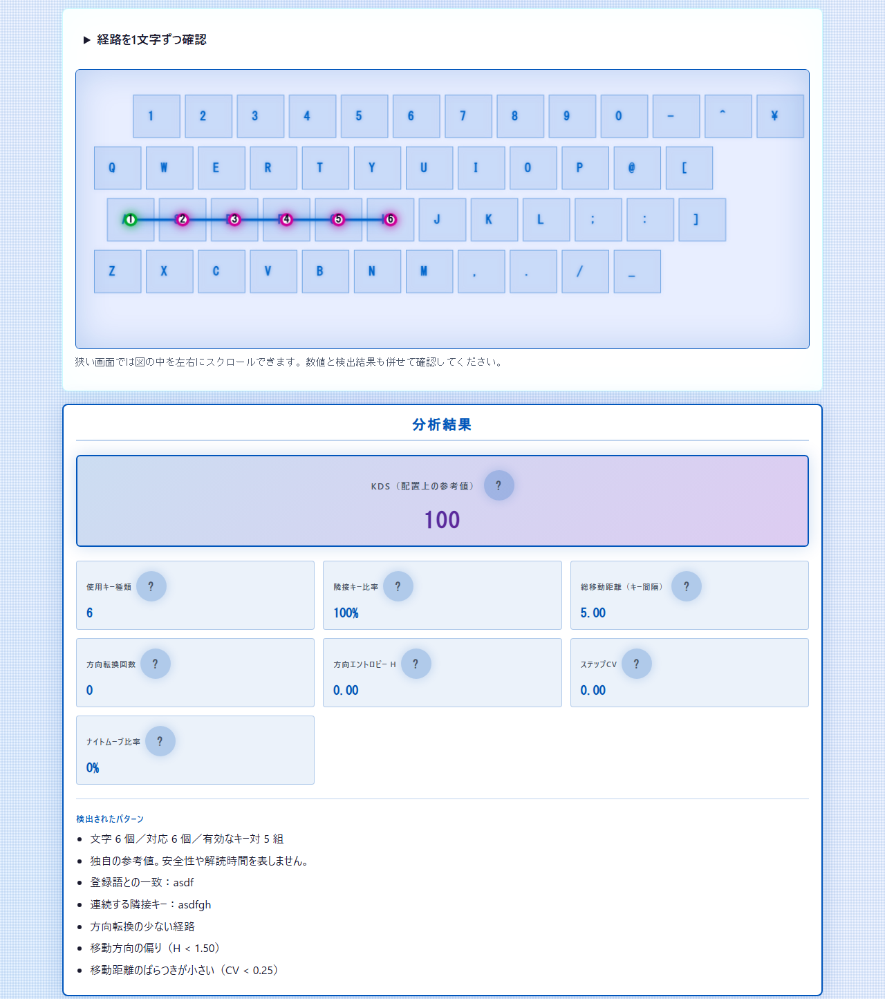
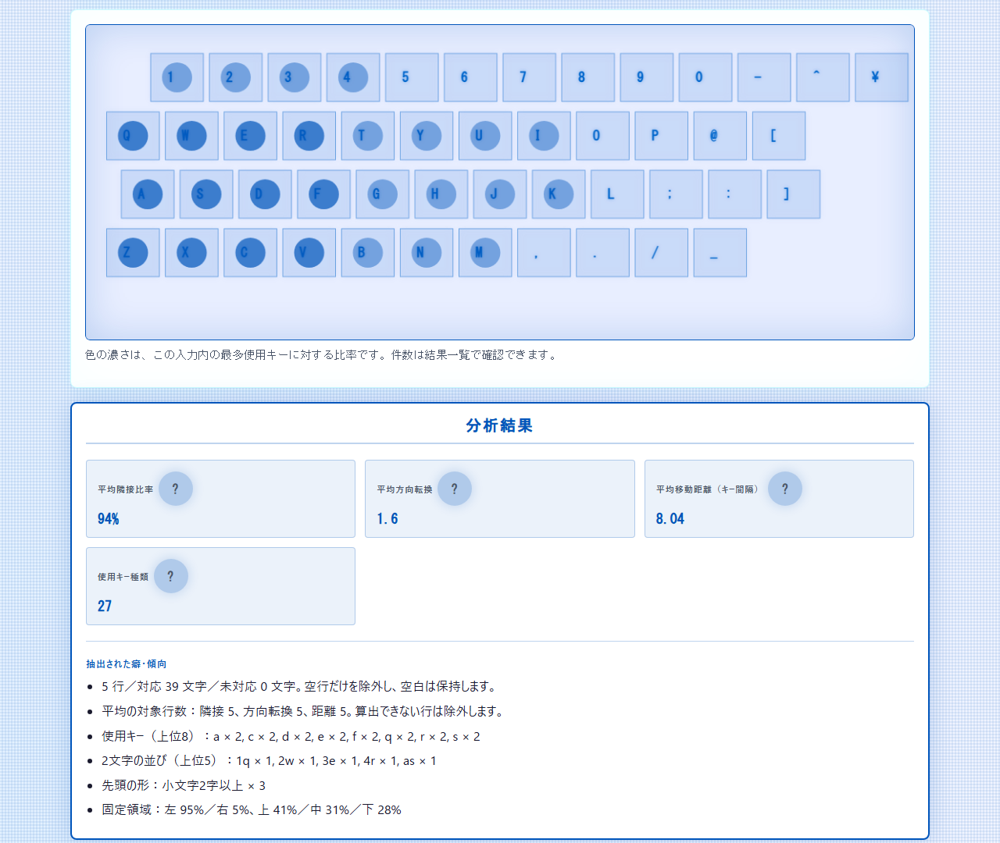
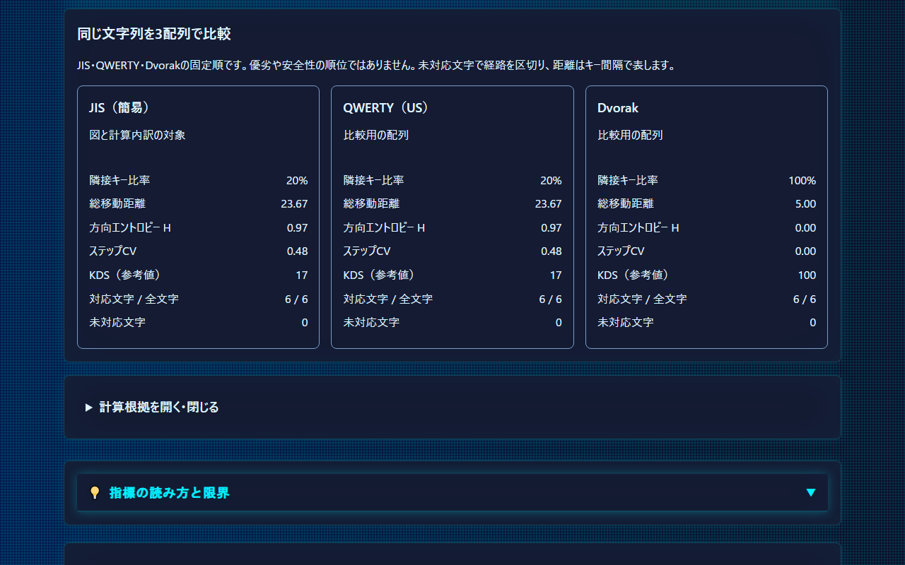
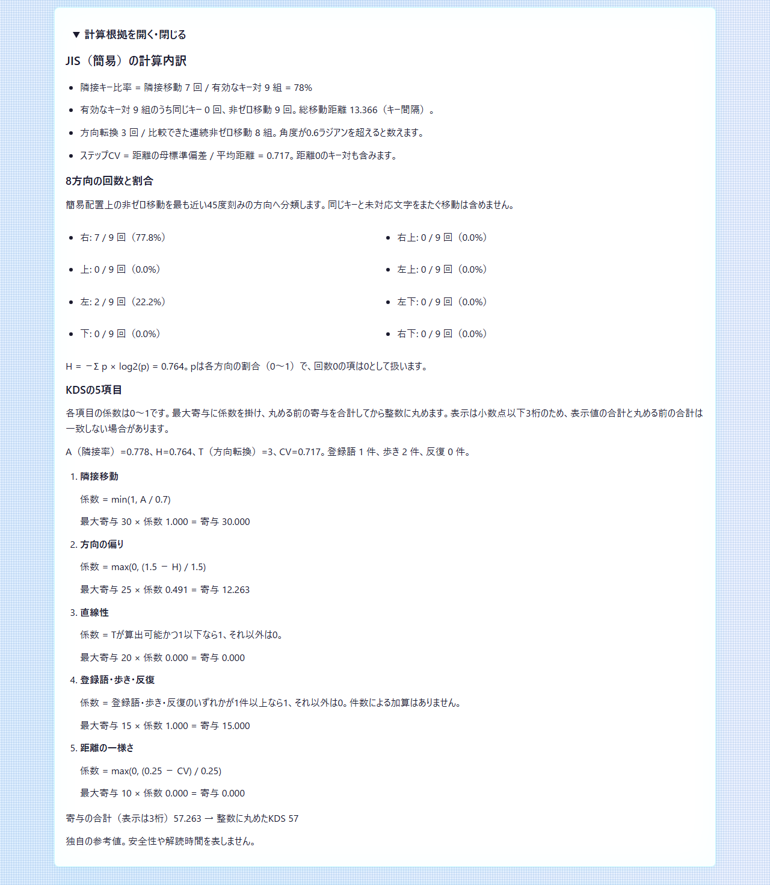
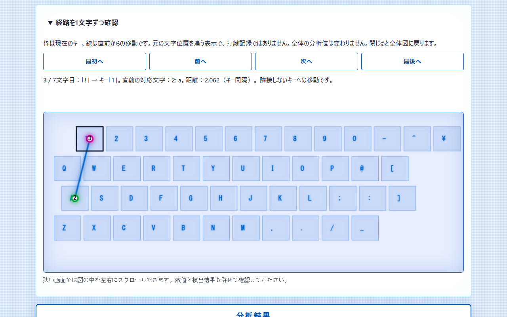

<!--
---
id: day089
slug: keywalk-analyzer

title: "KeyWalk Analyzer"

subtitle_ja: "キーボード依存パスワード分析ツール"
subtitle_en: "Keyboard-Dependent Password Analysis Tool"

description_ja: "学習用文字列を簡略キーボード配列に可視化し、隣接移動・反復・複数行の頻度を観察する教材。パスワードの強度や人物の特定には使えません。"
description_en: "Visualize learning strings on simplified keyboard layouts and explore adjacent moves, repetition, and frequencies across lines. Not a password strength or identity assessment."

category_ja:
  - パスワード分析
  - パスワード解析
category_en:
  - Password Analysis
  - Password Cracking

difficulty: 3

tags:
  - password
  - keyboard-walking
  - visualization
  - canvas
  - security
  - profiling
  - javascript

repo_url: "https://github.com/ipusiron/keywalk-analyzer"
demo_url: "https://ipusiron.github.io/keywalk-analyzer/"

hub: true
---
-->

[English](README.en.md) · 日本語

# KeyWalk Analyzer — キーボード依存パスワード分析ツール


[](https://ipusiron.github.io/keywalk-analyzer/)

**Day089 - 生成AIで作るセキュリティツール100**

KeyWalk Analyzerは、学習用文字列をキーボード座標上に可視化し、「キーボード歩き（隣接キーの連続）」や反復を観察する教育用ツールです。複数行から、キーの出現頻度や文字列に共通する特徴も集計できます。

**パスワードの強度・安全性・解読時間を判定するツールではありません。** KDSは、このツール独自の幾何学的な参考値です。人の識別や普段の入力動作の証明にも使えません。

---

## 🌐 デモページ

[KeyWalk Analyzerを開く](https://ipusiron.github.io/keywalk-analyzer/)（インストール不要）

### クイックスタート

1. 単体分析タブでサンプルを選ぶか、学習用に作った文字列を入力します。
2. 配列を選び、「分析する」で経路と指標を確認します。
3. 癖プロファイルタブでは、1行に1つの文字列を入れて「癖を分析」を押します。
4. 「?」はクリック・タップ・キーボードのフォーカスで開き、Escapeで閉じられます。

実際のパスワードや秘密情報は入力しないでください。アプリは入力を送信・保存しませんが、ブラウザーや拡張機能の挙動、画面の覗き見までは制御できません。

---

## 📸 スクリーンショット



単体分析：隣接率100%、経路長5.00キー単位の例です。



癖プロファイル：学習用サンプルの頻度集計です。



同じ文字列でも、配列によって隣接率や距離が変わります。順位ではなく固定順で表示します。



隣接移動の回数、8方向の分布、KDSの5項目の寄与を確認できます。



逐次表示：JISの`!`は`1`キーに対応し、直前の`a`からの距離は2.062キー間隔です。

---

## 👥 対象ユーザー

- セキュリティの学習者・教育者：文字種の多さとキー配置の規則性を分けて考える教材
- 研究者・エンジニア：自分で用意したデータの幾何学的特徴を確認する補助
- 謎解き制作者・情報科の教員：配列による見え方の違い、頻度とエントロピーの学習

作者は悪用を勧めません。利用者の特徴やパスワードの安全性を、この出力だけで判断しないでください。

---

## ⌨️ キーマップウォーキングとは

キーボードウォーキング（Keyboard Walking）は、キーの配置に沿った文字列の並びです。`qwerty`や`asdfgh`は横方向の例です。本ツールは選んだ配列に文字列を当てはめます。実際に押したキーや指の動きを記録するものではありません。

### 学術的背景と評価の範囲

文字列の規則性と、攻撃に対する耐性は別の問題です。本ツールのKDSや閾値は攻撃データで較正しておらず、研究で得られた成功率や漏洩データの頻度を再現するものではありません。

実際の認証設計では、よく使われる値・漏洩した値のブロックリストとの照合なども必要です。[NIST SP 800-63B-4](https://pages.nist.gov/800-63-4/sp800-63b.html#passwordver)を参照してください。本ツールにその照合機能はありません。

---

## 🖥️ 入力デバイスとキーボードレイアウトによる変化

### 対応する簡略配列

QWERTY (US)、JIS (日本語/簡易)、Dvorakの英数字・記号部分を扱います。キー間隔を1とする座標モデルであり、実機の寸法や打ちやすさの測定ではありません。

大文字はASCII小文字と同じキー、Shift記号は選択配列の対応キーとして扱います。たとえばJISでは`&`は`6`、`+`は`;`に対応します。USでは`&`は`7`、`+`は`=`です。

JISの`\`は数字段、`_`は下段のキーへ対応させます。入力済みの文字だけから、同じ文字を出す複数の物理キーや円記号との違いを復元することはできません。U+00A5の円記号は未対応です。QWERTYへの代替マッピングは行いません。

### 対象外の入力方式

かな配列・IME変換過程・AZERTY・QWERTZ・テンキー・ATMのPINパッド・スマートフォンのパターンロックはモデル化していません。画面はスマートフォンでも操作できますが、フリックやソフトウェアキーボードの指の移動は測定しません。

物理キーを示す`KeyboardEvent.code`と入力文字は異なります。[W3C UI Eventsの配列解説](https://www.w3.org/TR/uievents-code/#keyboard-layout)も参照してください。本ツールは打鍵履歴ではなく、入力欄の文字列を分析します。

---

## 🔧 本ツールの機能

### 1. 単体分析モード

経路（線）・点のみの表示、3配列、学習用サンプルを備えています。緑は各区間の始点、ピンクはそれ以降の点で、安全性の色分けではありません。番号は元の文字列の1始まりの位置です。

| 指標 | 定義・限界 |
|---|---|
| 使用キー数 | 対応できたキーの種類数。大文字・Shiftを別キーと数えない |
| 経路長 | 対応する連続キー間のユークリッド距離の合計。キー間隔1の単位で、pxやcmではない |
| ターン数 | 続く2つの非ゼロ移動の角度が0.6ラジアンを超える回数。比較できる組がなければ「—」 |
| 隣接率 | 連続する対応キー対のうち、異なるキーで横・縦の差がともに1以下の割合 |
| 方向エントロピーH | 非ゼロ移動の8方向分布から算出する0〜3ビットの値。パスワードのエントロピーではない |
| ステップCV | 移動距離の母標準偏差÷平均。2移動未満、または平均0なら「—」 |
| ナイト比率 | 横:縦が2:1または1:2に近い移動の割合。横の許容差0.25。ランダム性は示さない |
| KDS | 幾何学的特徴を組み合わせた0〜100の独自参考値。高低で安全性を判定しない |

同じキーの連打は、隣接率・ナイト比率・CVの分母に含めますが、隣接移動・方向・ターンとは数えません。空白や未対応文字で経路を切り、そこをまたぐ距離・移動・歩きを作りません。

KDSは、未対応文字がなく、対応文字が4文字以上、非ゼロ移動が3回以上のときだけ表示します。重みは隣接30%、方向偏り25%、直線性20%、登録語・歩き・反復15%、距離の一様さ10%です。計算式は[ARCHITECTURE.md](ARCHITECTURE.md)に記載しています。

検出対象は3文字以上の隣接歩き、登録語7件、2〜4文字の反復（重複を含め3回以上）です。登録語は`qwerty`、`asdf`、`zxcv`、`1234`、`password`、`pass`、`admin`です。見つからないことは安全性の根拠になりません。

#### 配列比較と計算根拠

単体分析を実行すると、同じ入力をJIS、QWERTY、Dvorakの固定順で比較します。
隣接率、総移動距離、H、CV、KDSに加え、対応文字数と未対応文字数を表示します。
配列ごとに対応付けを行うため、未対応文字やKDSの算出可否も異なる場合があります。
順位や安全性の優劣を示すものではありません。

「計算根拠を開く・閉じる」では、図に選んだ配列の内訳を確認できます。
隣接率の分母と分子、距離0の繰り返し、方向転換を比較できた組数、8方向の回数と割合、KDSの係数と寄与を表示します。
非ゼロ移動がなければHを、キー対が2組未満または平均距離0ならCVを算出できない理由も表示します。
KDSが算出対象外の場合、各項目の係数と寄与は0ではなく「—」です。

JISの`qwerty123!`のKDS内訳は次のとおりです。
係数と寄与は小数点以下3桁で表示し、計算には丸める前の値を使います。

| 項目ID | 最大寄与 | 係数 | 寄与 |
|---|---:|---:|---:|
| adjacency | 30 | 1.000 | 30.000 |
| direction | 25 | 0.491 | 12.263 |
| turns | 20 | 0.000 | 0.000 |
| pattern | 15 | 1.000 | 15.000 |
| variation | 10 | 0.000 | 0.000 |

寄与の合計は表示上57.263、整数に丸めたKDSは57です。
登録語、歩き、反復はいずれかが見つかれば最大15を加算し、件数に応じた加算は行いません。
表示値同士の掛け算や合計は、内部の丸める前の計算と一致しない場合があります。

#### 経路を1文字ずつ確認

分析後、図の上の「経路を1文字ずつ確認」を開きます。
「最初へ」「前へ」「次へ」「最後へ」で、元の入力の位置、文字、対応キー、直前からの距離を確認できます。
位置は1始まりのUnicodeコードポイント単位で、絵文字や未対応文字も数えます。

開いている間、図には現在のキーと、その直前からの有効な移動だけを表示します。
現在のキーを枠で示し、狭い画面ではそのキーが見える位置へ横スクロールします。
「点のみ」では移動線を描きません。
同じキーの繰り返しは距離0、始点や未対応文字では距離を「—」とし、未対応文字をまたぐ線は描きません。
これは文字列を配列に当てはめた表示で、実際の打鍵記録ではありません。

JISで`Aa!😀 sd`を分析した例です。
空白は`[U+0020]`と表示します。

| 位置 | 文字 | 対応キー | 直前からの距離 | 状態 |
|---:|---|---|---:|---|
| 1 | `A` | `a` | — | 始点 |
| 2 | `a` | `a` | 0.000 | 同じキー |
| 3 | `!` | `1` | 2.062 | 隣接しない移動 |
| 4 | `😀` | — | — | 未対応 |
| 5 | `[U+0020]` | — | — | 未対応 |
| 6 | `s` | `s` | — | 区切り後の始点 |
| 7 | `d` | `d` | 1.000 | 隣接移動 |

全体の分析値、配列比較、計算内訳は選択位置によって変わりません。
逐次表示は入力上限の10,000文字目まで確認でき、閉じると先頭500対応キーまでの全体図に戻ります。
入力編集、配列変更、クリア、IME変換開始で逐次表示も無効化し、再分析は最初の文字から始めます。
言語、テーマ、表示モード、タブの切り替えでは位置を保持します。

### 2. 癖プロファイルモード

複数行を集計し、キー頻度のヒートマップ、上位8キー、上位5個の2文字列、接頭・接尾の文字形式、固定領域の割合を表示します。ヒートマップの濃さは入力集合内の最多キーに対する相対値です。

- 平均値：隣接率・ターン数・経路長は行ごとの単純平均。計算できない行を除き、指標ごとの対象行数を表示
- 経路長の平均：対応キー対がない行を除外。同じキーの連打による距離0は含む
- 領域：配列全体の中央で左右を区分。上段は数字段とその次の段、中段はホーム段、下段は最下段。左右の手の使用率ではない
- 年らしい末尾：1900〜2099と、その後の`!?.`を照合。年・誕生日の事実認定ではない
- 集計単位：空行のみ除外。前後の空白を保存し、重複行もその回数だけ数える
- 2文字列：英字の大小のみ統合。Shift記号はその文字のまま区別し、未対応文字と改行をまたがない

同じ人が入力したか、普段どう打鍵するかは、この集計からわかりません。

---

## 📖 使用方法

### 単体分析タブ

文字列を入力し、配列を選んで分析します。入力や配列を変えると、そのタブの結果を消します。表示モード・言語・テーマを変えると、保持した結果を描き直します。

配列比較と計算内訳も同じ結果に追従します。
別の配列の内訳を見るときは配列を選び直して分析してください。入力文字列は保持します。
計算内訳の開閉はクリック、タップ、フォーカス時のEnterまたはSpaceで操作できます。

### 癖プロファイルタブ

1行に1つの学習用文字列を入力します。単体分析とは入力・配列・結果が独立しています。「クリア」は現在のタブの入力と結果を消します。もう一方のタブやクリップボードは消しません。

タブは左右矢印・Home・Endでも選べます。キーボード図は狭い画面では横にスクロールできます。図だけでなく数値と検出内容も確認してください。

### 言語・テーマとローカル実行

初期言語は`?lang=ja|en`、保存した設定、ブラウザーの言語の順で決まります。初期テーマは保存した設定、OSの明暗設定の順です。保存できない環境でも動作します。

`index.html`をブラウザーで直接開けます。Pythonがある場合は、リポジトリールートで次のようにHTTP配信できます。追加パッケージは不要です。

```sh
python -m http.server 8000 --bind 127.0.0.1
```

`http://127.0.0.1:8000/`を開きます。

---

## 💡 サンプル入力例

### 単体分析

次の値は計算部と照合しています。距離とHは小数点以下2桁、隣接率は整数に丸めた表示です。`—`は算出対象外です。空文字では画面の指標を消します。

| 入力 | 配列 | 使用キー数 | 経路長 | 隣接率 | H | KDS |
|---|---|---:|---:|---:|---:|---:|
| `a` | jis | 1 | 0.00 | — | — | — |
| `aaaa` | jis | 1 | 0.00 | 0% | — | — |
| `asdfgh` | jis | 6 | 5.00 | 100% | 0.00 | 100 |
| `hgfdsa` | jis | 6 | 5.00 | 100% | 0.00 | 100 |
| `qwerty123!` | jis | 9 | 13.37 | 78% | 0.76 | 57 |
| `asd fgh` | jis | 6 | 4.00 | 100% | 0.00 | — |
| `aoeuid` | jis | 6 | 23.67 | 20% | 0.97 | 17 |
| `aoeuid` | dvorak | 6 | 5.00 | 100% | 0.00 | 100 |

`asd fgh`では空白で分かれた`asd`と`fgh`を別の歩きとして扱います。隣接率100%でも入力全体を評価できたわけではありません。KDS17の`aoeuid`も「安全」という意味ではありません。

### 癖プロファイル

次の2行は、使用キー数4、平均隣接率100%、平均経路長2.00、左側75%になります。平均の対象は`asd`の1行です。`p`はキー頻度には含みますが、移動がないので平均経路長・隣接率には含めません。

```text
asd
p
```

---

## 🎯 ユースケース

このツールならではの使い方

- 情報科の授業で「方向の多様さ」と「向き」を区別する：JISの`asdfgh`と`hgfdsa`は逆向きでも、経路長5.00、H=0.00で一致する。Hだけでは進む向きを復元できず、元の経路を見る必要がある。
- 謎解き制作者が配列をヒントにする：`aoeuid`の隣接率はJISで20%、Dvorakで100%となる。配列を示すことで、同じ文字列の別の読み方を作れる。実際の入力端末や利用者の配列を特定する証拠にはならない。
- 調査データの重複が集計に与える影響を見る：JISで`asd / p`の2行を入れると左側75%、`asd / asd / p`の3行なら86%になる（`/`はここでは改行の意味）。重複を数える集計と標本の偏りを学べるが、人の癖の変化を示すものではない。

そのほかの活用例

- セキュリティ研修で、公開サンプルの文字種とキー配置を比較する。KDSを下げる練習や合否判定には使わない
- CTFや辞書研究で、手元の候補文字列にどの経路が現れるか観察する。辞書生成・エクスポート・解読機能はない
- 認証設計の検討で、幾何学的な指標だけでは漏洩・再利用・試行制限を判断できないことを説明する。実在アカウントの秘密を収集しない
- 家庭で公開サンプルを使い、文字列を変更することと、サービスごとに異なる長いパスワードを管理することの違いを話し合う

---

## ⚙️ 制限事項

- 単体入力は10,000文字、複数行は合計50,000文字・500非空行・各行10,000文字まで。文字数はUnicodeコードポイント単位
- 上限超過は切り詰めずにエラーとし、結果を消す。IME変換中は分析を無効化
- 図の経路は対応文字の先頭500点まで、検出リストは種類ごとに先頭20件まで。省略を表示し、指標は上限内の全文で計算
- 空白・日本語・絵文字など、配列に対応しない文字は位置とともに通知。不可視文字は`[U+XXXX]`形式で表示
- キーの実寸、左右の手、打鍵時間、打ちやすさ、パスワード強度、解読時間、人物同定は評価しない
- 公開サンプルの「混在例」は乱数で生成した安全な秘密ではない。実際のパスワードに転用しない

---

## 💻 技術仕様

### フロントエンド

HTML・CSS・JavaScript・Canvasを使用します。ビルド、外部フォント、ライブラリー、追加依存パッケージは不要です。計算部はDOM非依存で、ブラウザーの通常のスクリプトとNode.jsのCommonJSから同じ実装を利用します。

### セキュリティ

入力はアプリから送信・永続化しません。localStorageに保存するのは`theme`と`language`だけです。CSPは接続・フォーム送信などを制限しますが、初回のページ取得や利用者が開く外部リンクまで禁止するものではありません。

`X-Frame-Options`や`X-Content-Type-Options`をHTMLのmetaで設定できるとは主張しません。HTTPレスポンスヘッダーはホスティング側の設定です。[SECURITY.md](SECURITY.md)に設計と限界をまとめています。

### 対応ブラウザー

JavaScript・Canvas・Unicodeプロパティエスケープ対応のブラウザーを想定しています。今回の自動検証はChromiumで、HTTPと`file://`、日本語・英語、明暗、幅320・390・1280pxを確認しています。Firefox・Safariと実機のタッチ操作は未検証です。

---

## 🧪 テスト

Node.js 22以上で実行します。依存パッケージのインストールは不要です。

```sh
npm test
```

配列・Shift記号・未対応文字・境界値・集計・日英辞書・READMEの表・CSP・コントラスト・ファイルの整形を検証します。GitHub Actionsはpushとpull_requestで同じテストを実行します。

---

## 📁 ディレクトリー構成

```text
keywalk-analyzer/                      # プロジェクトルート
├── .github/                           # GitHub設定
│   └── workflows/                     # 自動テスト
│       └── test.yml                   # Node.js 22でpush・PRを検証
├── assets/                            # 画面画像・アイコン
│   ├── en/                            # 英語版の画面画像
│   │   ├── screenshot.png             # 英語・単体分析・ライト
│   │   ├── screenshot2.png            # 英語・プロファイル・ライト
│   │   ├── screenshot3.png            # 英語・3配列比較・ダーク
│   │   ├── screenshot4.png            # 英語・計算内訳・ライト
│   │   └── screenshot5.png            # 英語・逐次経路・ライト
│   ├── favicon.svg                    # サイトアイコン
│   ├── screenshot.png                 # 日本語・単体分析・ライト
│   ├── screenshot2.png                # 日本語・プロファイル・ライト
│   ├── screenshot3.png                # 日本語・3配列比較・ダーク
│   ├── screenshot4.png                # 日本語・計算内訳・ライト
│   └── screenshot5.png                # 日本語・逐次経路・ライト
├── test/                              # 依存なしの回帰テスト
│   ├── core.test.js                   # 配列・指標・境界値
│   ├── format.test.js                 # 整形・非圧縮の検査
│   ├── messages.test.js               # 日英辞書の一致
│   ├── readme.test.js                 # 日英の例・画像・構造
│   ├── security.test.js               # CSP・保存・操作の構造
│   ├── settings.test.js               # 初期設定と保存拒否
│   └── ui.test.js                     # 表示・コントラスト
├── .gitignore                         # Git対象外の指定
├── .nojekyll                          # Jekyll処理を無効化
├── ARCHITECTURE.md                    # 計算式と設計
├── CLAUDE.md                          # 開発作業の規則
├── LICENSE                            # MITライセンス
├── README.md                          # 日本語の説明
├── README.en.md                       # 英語の説明
├── SECURITY.md                        # 安全対策と限界
├── index.html                         # 画面とmeta CSP
├── keywalk-core.js                    # DOM非依存の計算
├── keywalk-messages.js                # 日英の分析メッセージ
├── keywalk-ui-messages.js             # 日英の本文・属性
├── package.json                       # Node.jsテスト設定
├── script.js                          # 描画と状態管理
├── settings.js                        # 初期の言語・テーマ
└── style.css                          # 明暗とレスポンシブ表示
```

---

## ⚠️ セキュリティ上の重要な注意事項

実際のパスワード、使い回している文字列、秘密情報を入力しないでください。「クリア」はアプリ内の現在のタブを空にする操作で、ブラウザーの復元、拡張機能、クリップボード、スクリーンショット、メモリーの完全消去を保証しません。

### ✅ 推奨される使用例

- 画面の公開サンプルでの学習
- 学習用に作った、実際の認証に使っていない文字列の比較
- 入力データの集め方と、観察結果の限界を確認する授業

---

## 📚 関連資料

### 開発者向けドキュメント

- [ARCHITECTURE.md](ARCHITECTURE.md)：座標モデル、各指標、KDSの式、状態管理
- [SECURITY.md](SECURITY.md)：通信・保存の範囲と制限
- [NIST SP 800-63B-4](https://pages.nist.gov/800-63-4/sp800-63b.html)：認証とパスワードのガイドライン。KDSの根拠ではない
- [W3C UI Events KeyboardEvent code Values](https://www.w3.org/TR/uievents-code/)：物理キーと入力文字の違い
- [W3C Content Security Policy](https://w3c.github.io/webappsec-csp/)：CSPの配信方法とディレクティブ

### 書籍

- [『ハッキング・ラボで遊ぶために辞書ファイルを鍛える本』](https://akademeia.info/?page_id=22508)…5.4「キーマップウォーキングパスワードの辞書ファイルを作成する」（P.79-88）

---

## 📄 ライセンス

MIT License – 詳細は [LICENSE](LICENSE) を参照してください。

---

## 🛠 このツールについて

本ツールは、「生成AIで作るセキュリティツール100」プロジェクトの一環として開発されました。
このプロジェクトでは、AIの支援を活用しながら、セキュリティに関連するさまざまなツールを100日間にわたり制作・公開していく取り組みを行っています。

プロジェクトの詳細や他のツールについては、以下のページをご覧ください。

🔗 [https://akademeia.info/?page_id=42163](https://akademeia.info/?page_id=42163)
